# IDEA Console — UI Design Document

**Version:** 0.2.27  
**Date:** 2026-04-29  
**Author:** Pixel (Console UI Developer)

> Screenshots captured automatically with Playwright headless Chromium via `scripts/screenshot-screens.ts`.

---

## Overview

IDEA Console is a web app (also packaged as a Chrome extension) for managing offline educational apps on IDEA Engines in schools. Operators (administrators) manage instances, disks, and users. Non-authenticated visitors can browse and launch apps.

The UI is a single-page app built with SolidJS. All screens render inside one `<div class="app">` — a persistent **status bar** at the top, and one **content area** below it that switches between screens using a `<Switch>/<Match>` block.

---

## Persistent Chrome: Status Bar

Present on **every screen**, always at the top.

| Element | Description | Visibility |
|---|---|---|
| Title + version | "IDEA Console v0.2.1" | Always |
| Status dot + label | Green dot + hostname when connected; orange "Scanning…"; red "No engine found" | Always |
| DEMO badge | Orange badge | Demo mode only |
| Username | Logged-in operator's name | Authenticated only |
| 👥 button | Toggles Operator Management screen | Authenticated only |
| Log out | Logs out current operator | Authenticated only |
| ⚙ button | Toggles Settings panel (✕ to close) | Always |

---

## Screen Inventory

The app has **8 distinct screens** (content area states):

| # | Screen | Trigger condition |
|---|---|---|
| 1 | Onboarding | Not configured and not in demo mode |
| 2 | Settings Panel | ⚙ button pressed |
| 3 | First-Time Setup | Engine connected, no users exist yet |
| 4 | App Browser (unauthenticated) | Connected, not logged in |
| 5 | Main Layout (authenticated) | Logged in as operator |
| 6 | Operator Management | 👥 button pressed while logged in |
| 7 | Empty Disk Panel | Operator selects an empty disk in tree |
| 8 | Restore Panel | Operator selects a backup disk in tree |

Additionally, one **modal overlay** can appear on top of any screen:

| # | Modal | Trigger |
|---|---|---|
| M1 | Login Form | "Log in" button in App Browser |

---

## Screen 1: Onboarding

**File:** `src/components/Onboarding.tsx`  
**When shown:** App has no configured hostname and is not in demo mode. Also shown embedded within the Settings panel's "Change engine" flow.

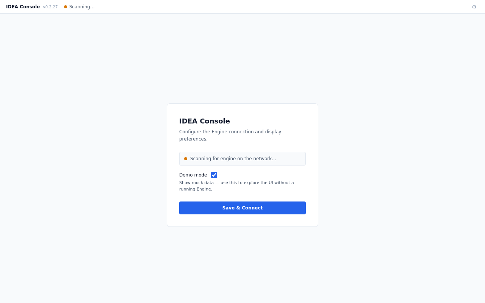

**Sub-state: Engine Picker** — if 2+ engines are found on the network, a list of discovered engines appears instead of the manual form. The user picks one or chooses "Enter manually".

**Flows from here:**
- Save & Connect → **Screen 3** (First-Time Setup) or **Screen 4** (App Browser)
- Demo mode on → **Screen 4** (App Browser, demo data)

---

## Screen 2: Settings Panel

**File:** `src/components/SettingsPanel.tsx`  
**When shown:** ⚙ button in status bar. Overlays the entire content area.

**Engine Connection tab:**

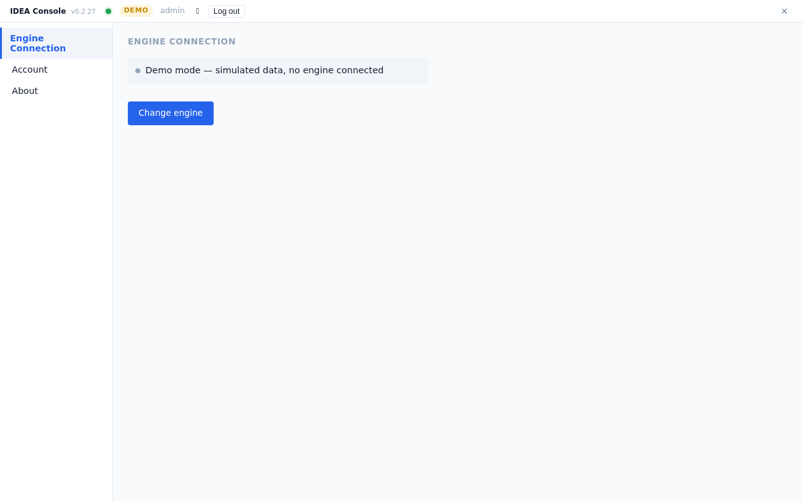

**Account tab** (operator only — change password):

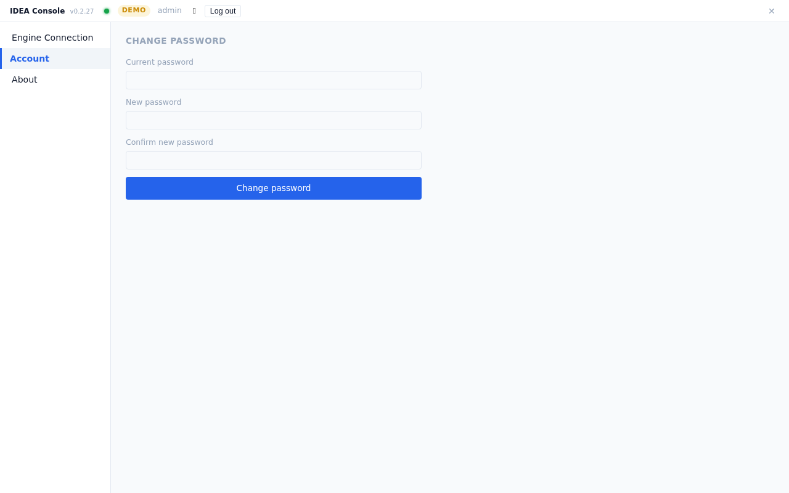

**About tab:**

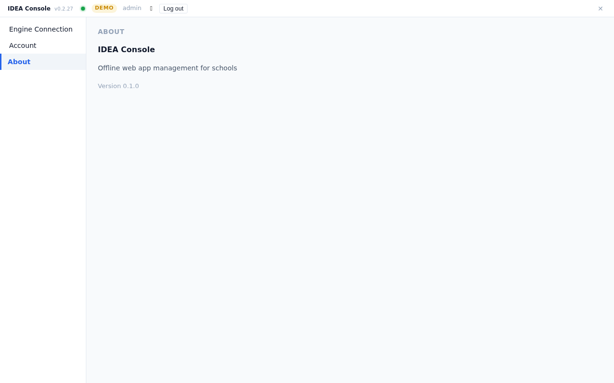

**Tabs:**
- **Engine Connection** — shows current connection status; "Change engine" opens `ChangeEngineDialog` sub-panel inline (hostname input + demo toggle + scan)
- **Account** — change password form (current / new / confirm); only shown when logged in
- **About** — app name, version, display mode selector (extension only)

**Flows from here:**
- ⚙ button again (toggles closed) → returns to previous screen
- Change engine → triggers reconnect, stays in Settings
- Switch to demo mode → reconnects in demo

> Note: there is no separate Close button inside the panel — the ⚙ status bar button toggles it open/closed.

---

## Screen 3: First-Time Setup

**File:** `src/components/FirstTimeSetup.tsx`  
**When shown:** Engine is connected but `userDB` is empty (no operators exist yet). Auto-provision of `admin/admin911!` also runs in the background when this condition is met.

_(No screenshot — requires a fresh engine with empty userDB. Hard to reproduce in demo mode.)_

**Flows from here:**
- Create account → **Screen 5** (Main Layout, automatically logged in)

---

## Screen 4: App Browser (Unauthenticated)

**File:** `src/components/AppBrowser.tsx`  
**When shown:** Default fallback — shown when connected (real or demo) but no operator is logged in.

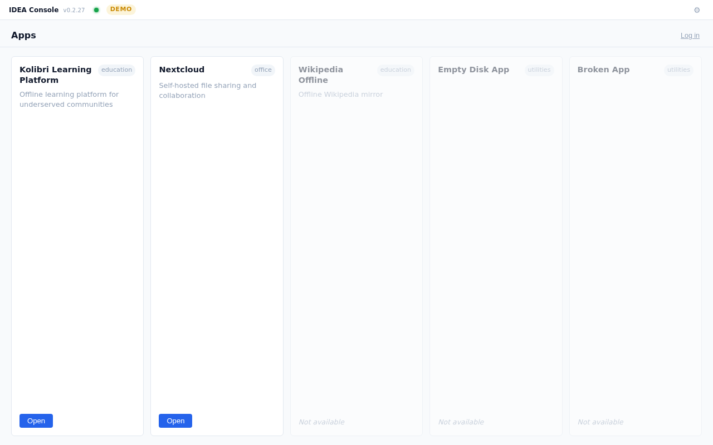

- App cards show all instances (Running and non-Running)
- Running apps show an "Open ↗" link to the app's URL on the engine
- Non-running apps are greyed out / unavailable
- "Log in" button → **Modal M1** (Login Form)

**Flows from here:**
- Log in → **Modal M1** → on success → **Screen 5** (Main Layout)

---

## Modal M1: Login Form

**File:** `src/components/LoginForm.tsx`  
**When shown:** Floats above App Browser (or any screen) when "Log in" is clicked. Rendered outside the Switch so it survives screen transitions.

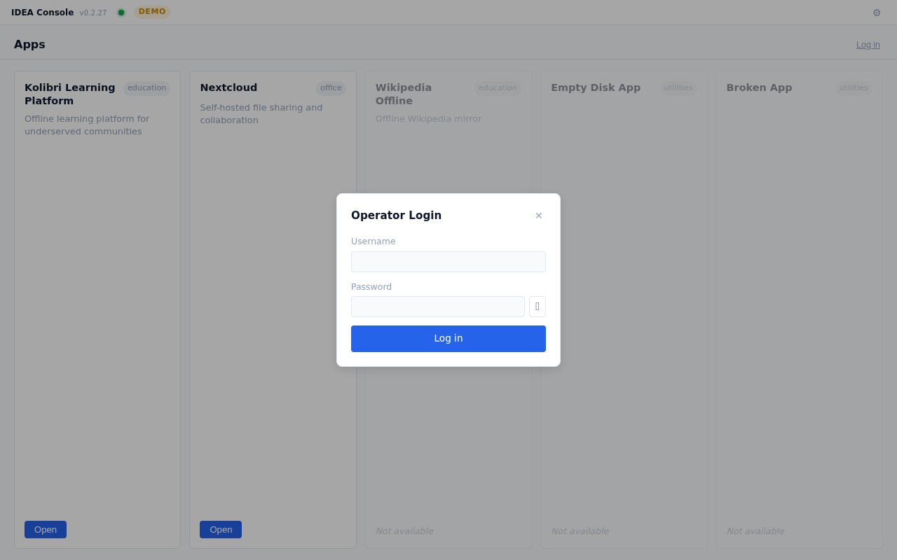

**Flows from here:**
- ✕ / Cancel → modal closes, returns to App Browser
- Successful login → modal closes → **Screen 5** (Main Layout)

---

## Screen 5: Main Layout (Authenticated)

**File:** `src/App.tsx` + `NetworkTree.tsx` + `InstanceList.tsx`  
**When shown:** Operator is logged in and Operator Management is not open.

**All instances selected (default):**

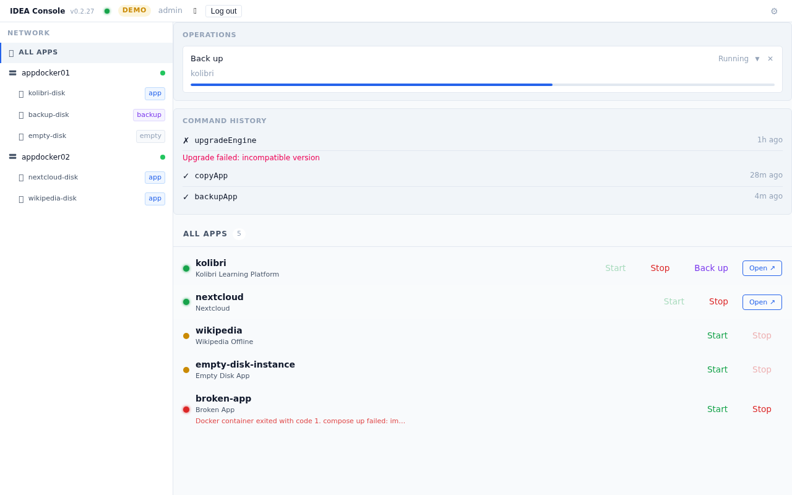

**Engine selected:**

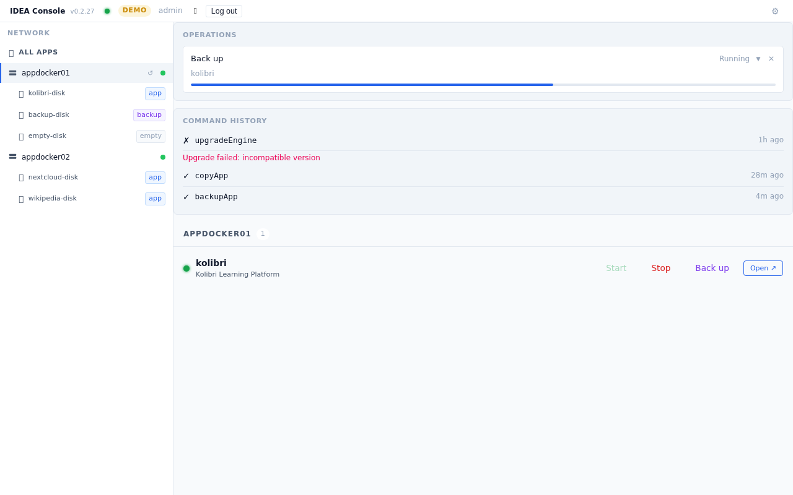

**Disk selected:**

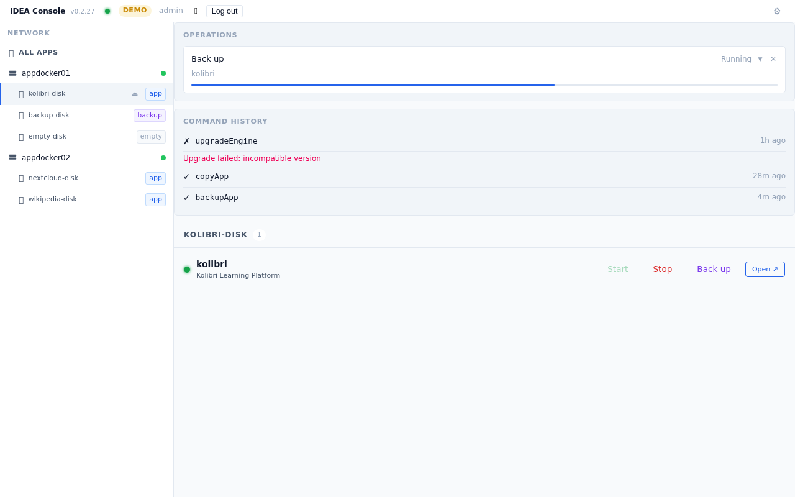

### Left Panel: Network Tree

Hierarchical tree:
1. **🌐 All instances** — top-level row, selects all
2. **⬛ Engine rows** — SVG server rack icon + hostname + online/offline badge (icon reflects headless server, not a desktop monitor)
3. **💾 Disk rows** (under each engine) — disk name + type badge (app / backup / empty / files / upgrade) + ⏏ eject button (not on backup disks)
4. **📦 Instance rows** (under each disk) — draggable; drag to another disk triggers Copy/Move modal

**Copy/Move modal** — appears inline in NetworkTree when an instance is dropped on a different disk:
- Instance name, source disk → target disk
- [Cancel] [Move] [Copy]

### Right Panel

Switches based on what's selected in the tree:

**a) Instance List** — default, shown for network / engine / app disk selections

Each `InstanceRow` shows:
- App name + status dot (Running / Stopped / Starting / Docked / Undocked)
- Start / Stop / Backup buttons (context-sensitive disabled states)
- Docker metrics if running: CPU %, RAM used, Disk used
- Last backup timestamp + backup disk chips
- Operation progress bar (inline, when an op is running)

**b) Empty Disk Panel** — shown when an empty disk is selected → **Screen 7**

**c) Restore Panel** — shown when a backup disk is selected → **Screen 8**

**Operation Progress bar** — shown above the right-panel content area when active operations exist. Shows kind label, args summary, progress bar, and status. Running operations additionally show a **live log panel** (`LogLines`) that streams captured command output in real time.


**Command History panel** — shown below the Operation Progress bar, always visible while logged in. Lists recently completed commands (newest first). Each row shows:
- ✓ / ✗ status icon + command name + time-ago label
- Click to expand → `LogLines` viewer with the full captured log for that trace
- Error message shown inline for failed commands
- "No command history yet" placeholder when empty

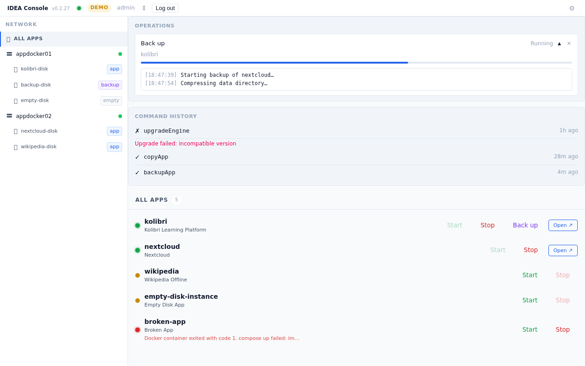

*Expanded trace (click a row to reveal log lines):*

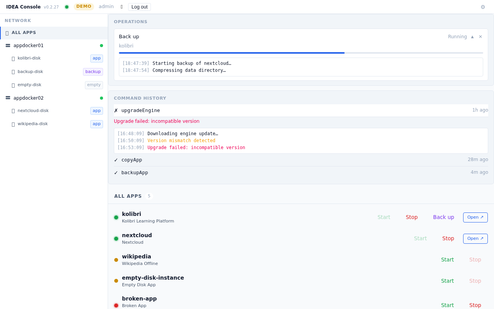

**Files:** `src/components/CommandHistory.tsx`, `src/components/LogLines.tsx`, `src/store/commandLog.ts`, `src/types/commandLog.ts`

---

## Screen 6: Operator Management

**File:** `src/components/OperatorManagement.tsx`  
**When shown:** 👥 button in status bar (replaces main layout content area entirely).

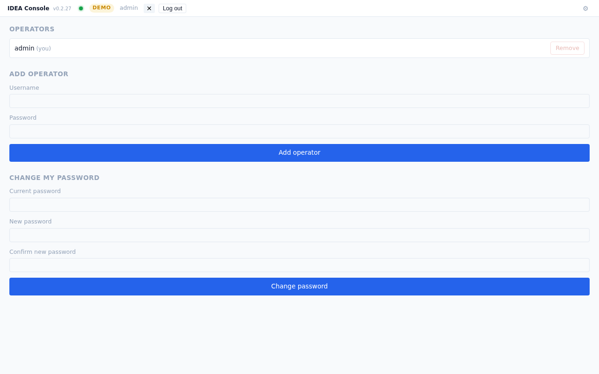

**Flows from here:**
- 👥 button again (✕) → returns to **Screen 5** (Main Layout)

---

## Screen 7: Empty Disk Panel

**File:** `src/components/EmptyDiskPanel.tsx`  
**When shown:** Operator selects an empty-type disk in the Network Tree (right panel of Main Layout).

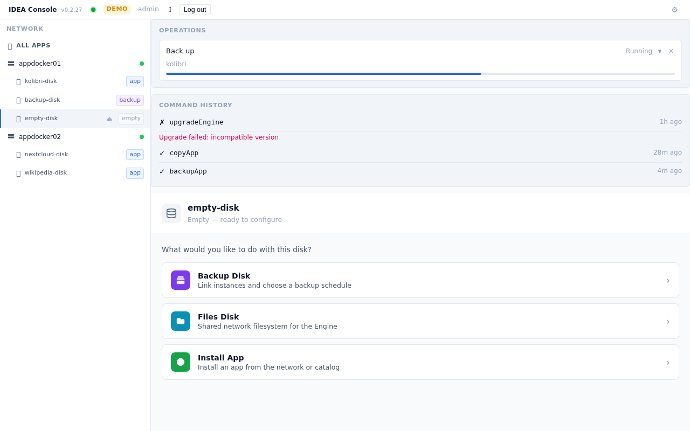

**Header:** disk icon + disk name + "Empty — ready to configure" subtitle. Back button appears when drilling into a sub-panel.

**Sub-states:**
- **Menu** — three action cards with coloured icons and chevrons:
  - 🟣 **Backup Disk** — link instances and choose a backup schedule
  - 🔵 **Files Disk** — shared network filesystem for the Engine
  - 🟢 **Install App** — install an app from the network or catalog
- **Backup Disk form** — radio group (On demand / Immediate / Scheduled) + instance checkbox list
- **Files Disk form** — confirmation text + submit
- **Install App form** — search input + app radio list + Install button
- **Success state** — confirmation message + Back button

---

## Screen 8: Restore Panel

**File:** `src/components/RestorePanel.tsx`  
**When shown:** Operator selects a backup-type disk in the Network Tree.

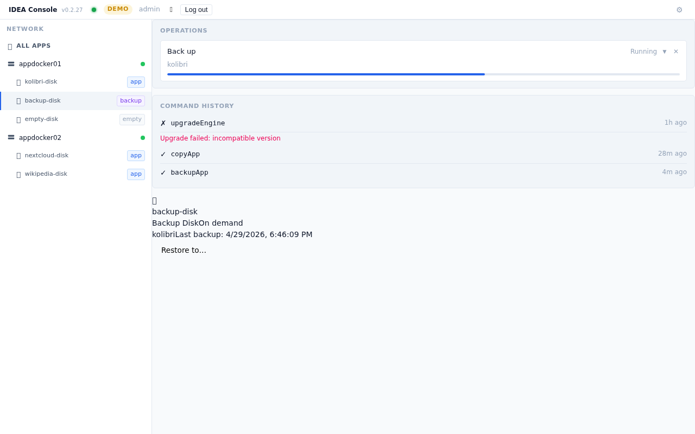

- Lists all instances linked to this backup disk
- Per-instance: last backup time, target disk selector, Restore button
- On submit: success state with [Back]

---

---

## Mobile Layout (≤600px)

**Files:** `src/components/MobileLayout.tsx`, `src/components/MobileAppList.tsx`  
**When shown:** Automatically on screens ≤600px wide (phones). Desktop layout is unchanged.

On mobile the main layout is replaced by a **bottom tab bar** with three tabs. The status bar remains at the top on all tabs.

### Tab 1 — Apps (default)

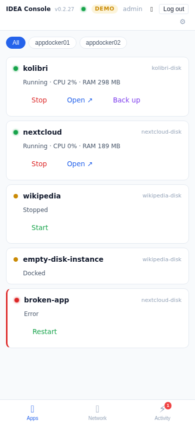

- Full-width app cards — name never truncated
- Engine filter chips at top to narrow by engine
- Status dot + name + disk name (right-aligned)
- Status line (Running · CPU% · RAM) below name
- Contextual action buttons per status:
  - Running: **Stop**, **Open ↗**, **Back up** (disabled during active op)
  - Stopped: **Start**, **Back up**
  - Error: **Restart**
- Inline progress bar + label when a backup op is active for that instance
- Error cards have a red left border

### Tab 2 — Network

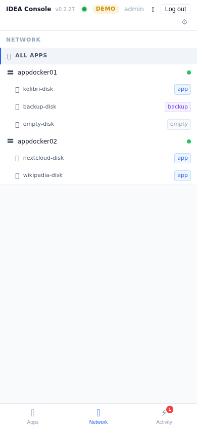

- Full-screen NetworkTree (no height cap)
- Same tree structure and behaviour as desktop

### Tab 3 — Activity

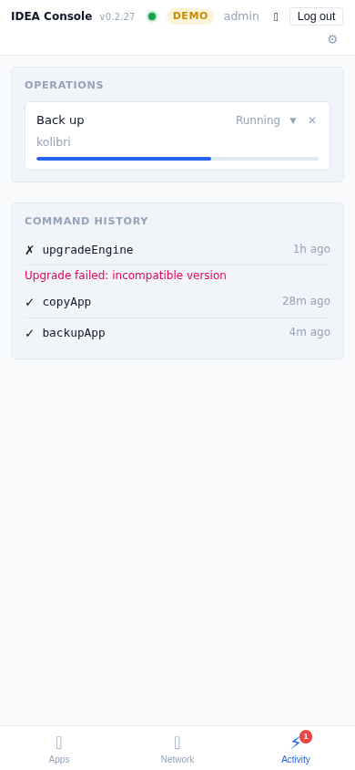

- OperationProgress + CommandHistory stacked vertically
- Red badge on the tab icon shows count of active operations (Running/Pending)

---

## Screen Flow Diagram

```
                         ┌──────────────┐
                    ┌───▶│  Onboarding  │────────────────────┐
                    │    │  (Screen 1)  │                     │
                    │    └──────────────┘                     │
                    │           │ Save & Connect              │
   App starts       │           ▼                             │
   no config ───────┘    ┌─────────────────┐                 │
                         │ First-Time Setup │                 │
                         │   (Screen 3)    │                 │
                         └────────┬────────┘                 │
                                  │ Create account           │
                 ┌────────────────▼──────────────────────┐   │
  ⚙ (any screen)│        STATUS BAR (persistent)        │   │
  ──────────────▶│  ⚙ Settings · 👥 Ops Mgmt · Log out  │◀──┘
                 └──────┬──────────────┬─────────────────┘
                        │              │
              Not logged in         Logged in
                        │              │
                        ▼              ▼
              ┌─────────────┐   ┌──────────────────────────┐
              │ App Browser │   │     Main Layout           │
              │ (Screen 4)  │   │     (Screen 5)            │
              └──────┬──────┘   │                          │
                     │ Log in   │  NetworkTree + right pane │
                     ▼          │  ┌──────┬────────┬──────┐ │
              ┌─────────────┐   │  │Inst. │ Empty  │Backup│ │
              │ Login Modal │   │  │ List │  Disk  │Disk  │ │
              │   (M1)      │   │  │(5a)  │ (S7)   │ (S8) │ │
              └──────┬──────┘   │  └──────┴────────┴──────┘ │
                     │ success  └──────────────┬─────────────┘
                     └──────────────────────────┘
                                               │ 👥
                                               ▼
                                    ┌─────────────────────┐
                                    │ Operator Management  │
                                    │    (Screen 6)        │
                                    └─────────────────────┘
```

---


