# IDEA Console — UI Design Document

**Version:** 0.2.85  
**Date:** 2026-05-28  
**Author:** Pixel (Console UI Developer)

> Screenshots captured automatically with Playwright headless Chromium via `scripts/screenshot-screens.ts`.

---

## Table of Contents

- [Overview](#overview)
- [Persistent Chrome: Status Bar](#persistent-chrome-status-bar)
- [Screen Inventory](#screen-inventory)
- [Screen 1: Connection Management](#screen-1-connection-management)
- [Screen 2: Settings Panel](#screen-2-settings-panel)
- [Screen 3: First-Time Setup](#screen-3-first-time-setup)
- [Screen 4: App Browser (Unauthenticated)](#screen-4-app-browser-unauthenticated)
- [Screen 5: Main Layout (Authenticated)](#screen-5-main-layout-authenticated)
- [Screen 6: Account Screen](#screen-6-account-screen)
- [Screen 7: Empty Disk Panel](#screen-7-empty-disk-panel)
- [Screen 8: Restore Panel](#screen-8-restore-panel)
- [Screen 9: History](#screen-9-history)
- [Mobile Layout (≤600px)](#mobile-layout-600px)
- [Screen Flow Diagram](#screen-flow-diagram)

---

## Overview

IDEA Console is a web app for managing offline educational apps on IDEA Engines in schools. Operators (administrators) manage instances, disks, and users. Non-authenticated visitors can browse and launch apps.

The UI is a single-page app built with SolidJS. All screens render inside one `<div class="app">` — a persistent **status bar** at the top, and one **content area** (Workspace Panel) below it that switches between screens using a `<Switch>/<Match>` block.

---

## Persistent Chrome: Status Bar

Present on **every screen**, always at the top.

| Element | Description | Visibility |
|---|---|---|
| Title + version | "IDEA Console v0.2.x" | Always |
| Status dot + label | Green dot + hostname when connected; orange pulsing "Scanning for engines..."; red "No engine found" | Always |
| DEMO badge | Orange badge | Demo mode only |
| Username | Logged-in operator's name | Authenticated only |
| **Right-side action group** (`status-bar__actions`) | Always flush to the far right; contains the buttons below in order | — |
| 🔌 button | Toggles Connection Management screen | Always except demo mode |
| 👤 button | Toggles Account Screen (shows login or user info depending on auth state) | Always |
| 📋 button | Toggles History screen (command history) | Always |
| ⚙ button | Toggles Settings panel (✕ to close) | Always |

All action buttons (🔌, 👤, 📋, ⚙) are icon-style, borderless, and grouped together on the right side via `margin-left: auto` on the `status-bar__actions` container. Each button turns to ✕ while its panel is open. Opening one panel closes all others.

---

## Screen Inventory

The app has **9 distinct screens** (content area states):

| # | Screen | Trigger condition |
|---|---|---|
| 1 | Connection Management | No configured hostname and not in demo mode; or 🔌 button pressed |
| 2 | Settings Panel | ⚙ button pressed |
| 3 | First-Time Setup | Engine connected, no users exist yet |
| 4 | App Browser (unauthenticated) | Connected, not logged in |
| 5 | Main Layout (authenticated) | Logged in as operator |
| 6 | Account Screen | 👤 button pressed |
| 7 | Empty Disk Panel | Operator selects an empty disk in tree |
| 8 | Restore Panel | Operator selects a backup disk in tree |
| 9 | History | 📋 button pressed |

---

## Screen 1: Connection Management

**File:** `src/components/ConnectionManagement.tsx`  
**When shown:** App has no configured hostname and not in demo mode (auto-shown after ~5s of scanning with no single result). Also toggled explicitly by the 🔌 button in the status bar. Hidden in demo mode.

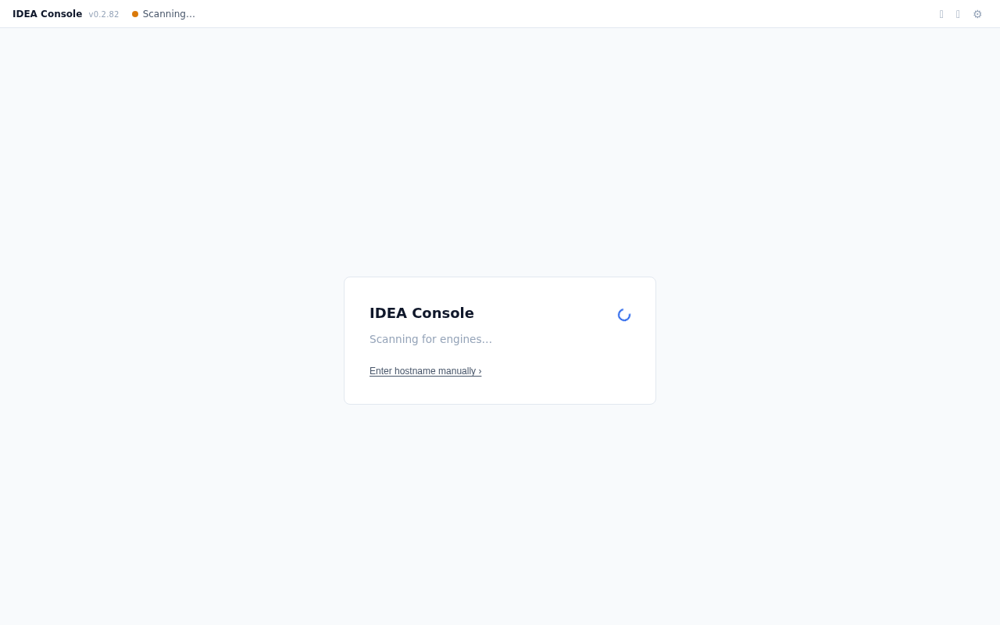

**Silent background discovery on app start:**
- When no saved hostname, non-production-web-mode, demo off: mDNS discovery starts immediately in background
- **Single engine found:** auto-connect silently, Connection Management screen never shown
- **Multiple engines found OR no engine after 5s:** Connection Management screen shown automatically

**States:**
- **Scanning** — corner spinner in the title row animates; label shows "Scanning for engines…"
- **Found** — engine list appears with Connect buttons; background refresh runs every 10s, merging new results in
- **Not found** — label shows "No engine found"

**Engine list** — discovered engines shown as `hostname` (`.local` stripped) + Connect button.

**Manual entry (inline)** — clicking "Enter hostname manually ›" replaces the link in-place with a text input, Connect button, and Cancel button. Supports `host:port` syntax. No separate sub-panel or Back navigation. Uses "last-used hostname" terminology.

**Flows from here:**
- Connect → **Screen 3** (First-Time Setup) or **Screen 4** (App Browser)

---

## Screen 2: Settings Panel

**File:** `src/components/SettingsPanel.tsx`  
**When shown:** ⚙ button in status bar. Overlays the entire content area.

**Engine Connection tab:**

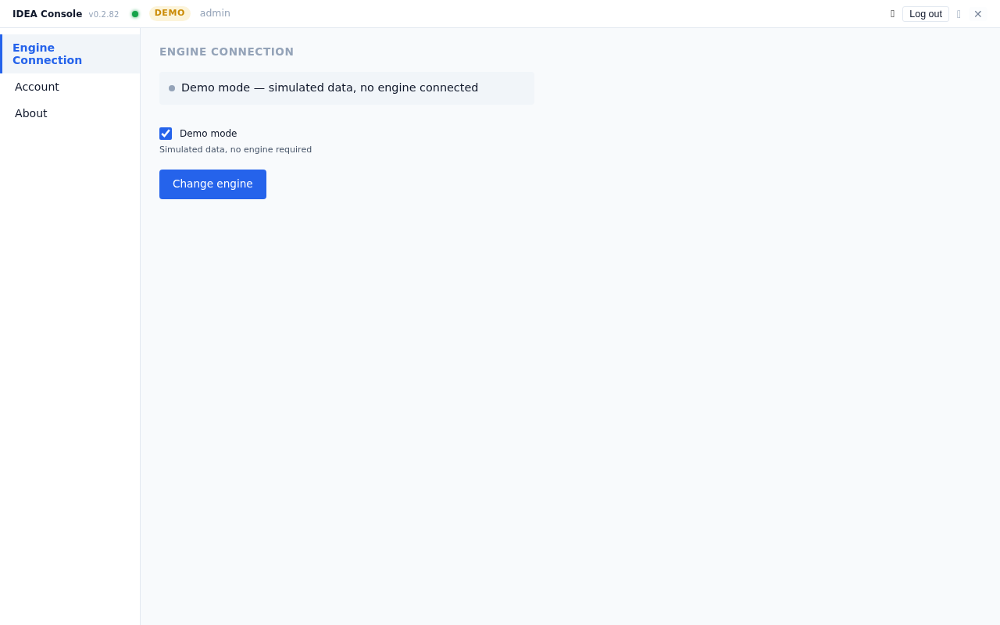

**Account tab** (operator only — change password):

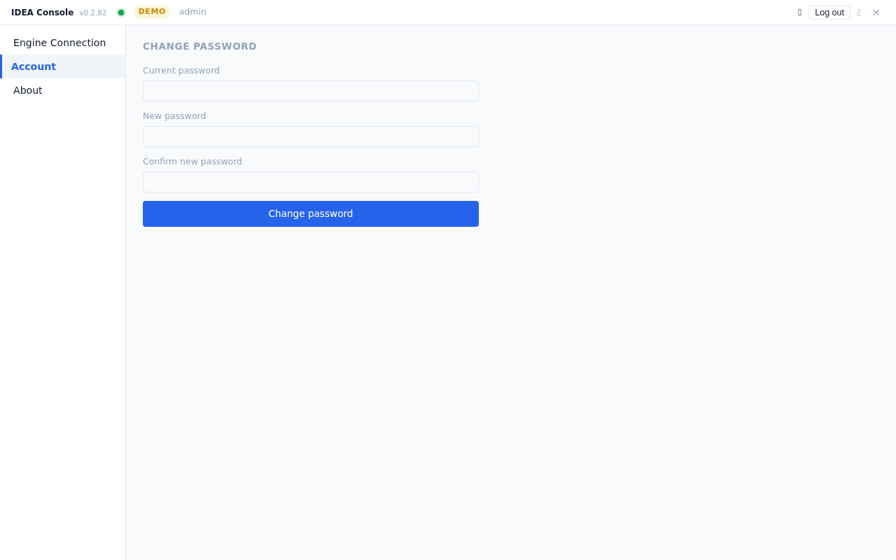

**About tab:**

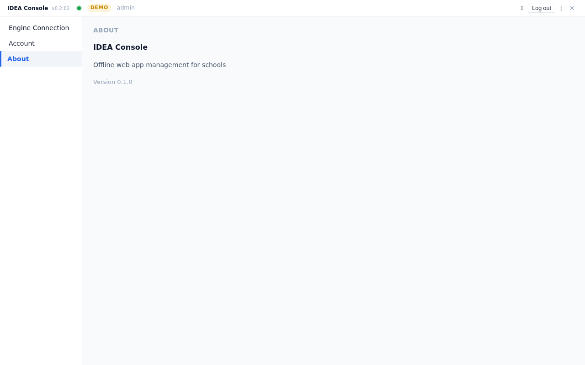

**Tabs:**
- **Engine Connection** — shows current connection status; **Demo mode toggle** (checkbox, always visible)
- **Account** — change password form (current / new / confirm); only shown when logged in
- **About** — app name, version (no extension-specific options)

**Flows from here:**
- ⚙ button again (toggles closed) → returns to previous screen
- Demo mode toggle → switches to/from demo mode without leaving Settings

> Note: there is no separate Close button inside the panel — the ⚙ status bar button toggles it open/closed.

---

## Screen 3: First-Time Setup

**File:** `src/components/FirstTimeSetup.tsx`  
**When shown:** Engine is connected but `userDB` is empty (no operators exist yet). Auto-provision of `admin/admin911!` also runs in the background when this condition is met.

_(No screenshot — requires a fresh engine with empty userDB. Hard to reproduce in demo mode.)_

**Flows from here:**
- Create account → **Screen 5** (Main Layout, automatically logged in)

---

## Screen 4: App Browser (Unauthenticated)

**File:** `src/components/AppBrowser.tsx`  
**When shown:** Default fallback — shown when connected (real or demo) but no operator is logged in.

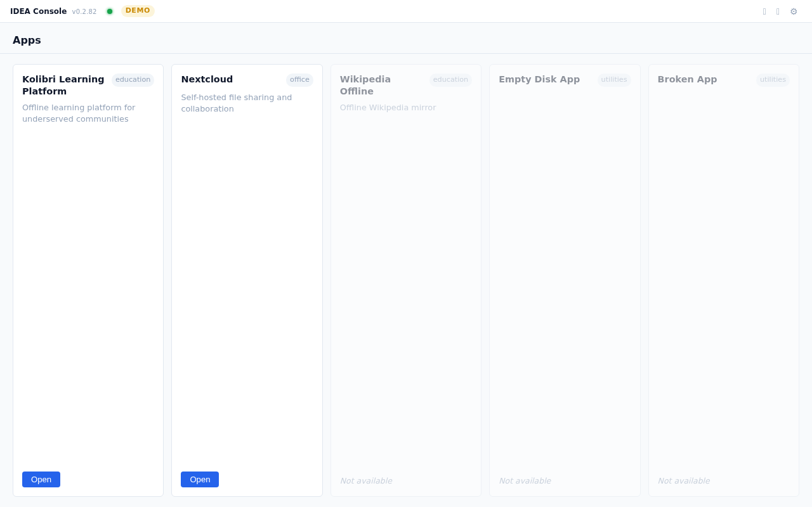

- App cards show all instances (Running and non-Running)
- Running apps show an "Open" button linking to the app's URL
- Non-running apps show "Not available"
- No login link in the app content area — login is via the 👤 icon in the status bar only

**Flows from here:**
- 👤 in status bar → **Screen 6** (Account Screen, shows login form) → on success → **Screen 5** (Main Layout)
- After logout: Account Screen shows login form (no auto modal)

---

## Screen 5: Main Layout (Authenticated)

**File:** `src/App.tsx` + `NetworkTree.tsx` + `InstanceList.tsx`  
**When shown:** Operator is logged in.

**All instances selected (default):**

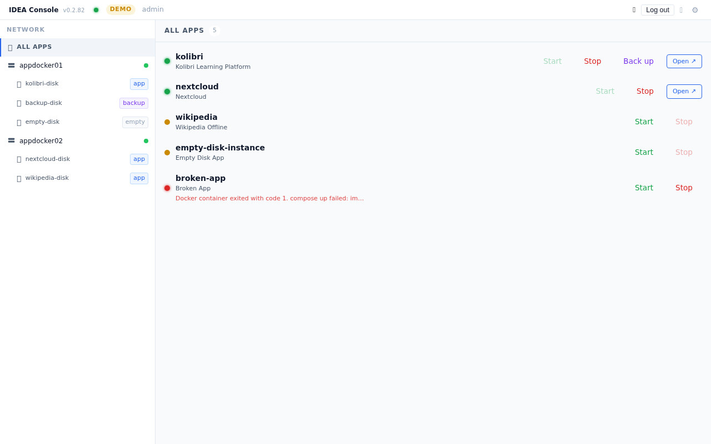

**Engine selected:**

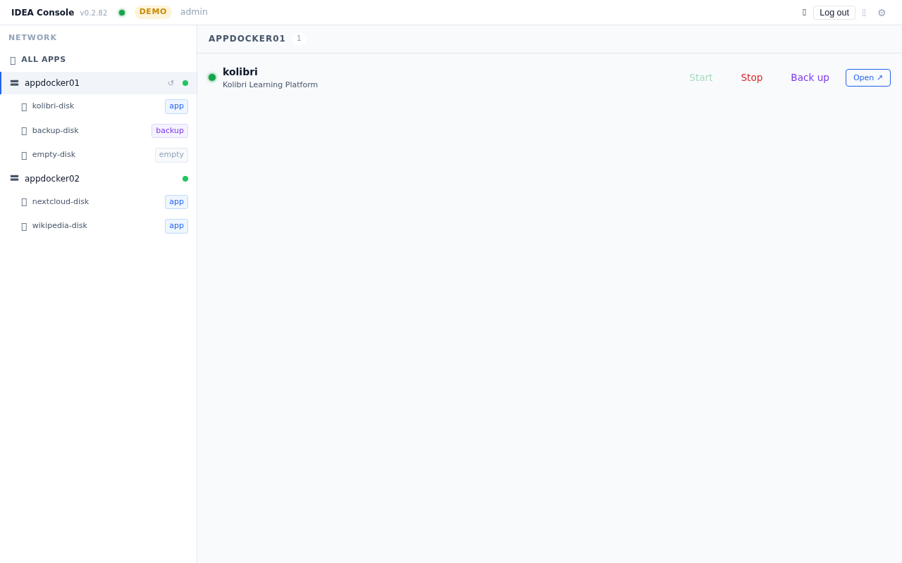

**Disk selected:**

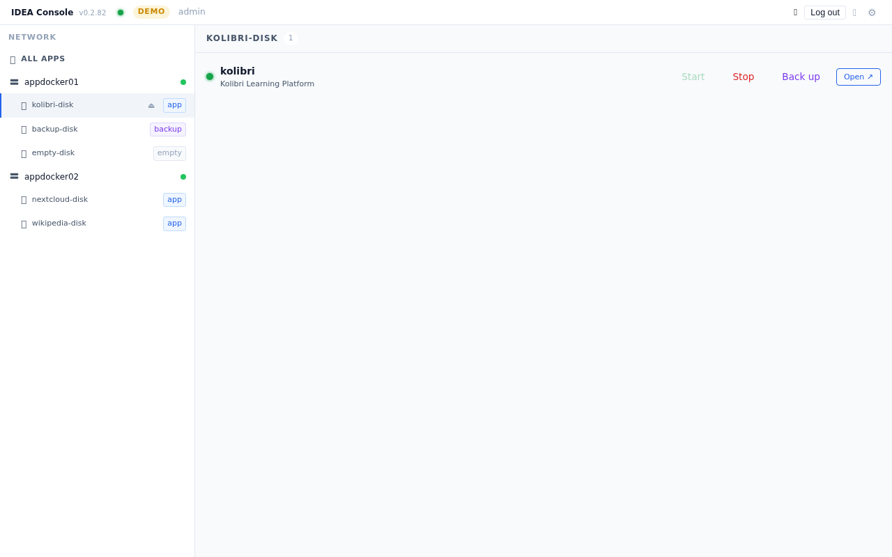

### Left Panel: Network Tree

Hierarchical tree:
1. **🌐 All instances** — top-level row, selects all
2. **⬛ Engine rows** — SVG server rack icon + hostname + online/offline badge (icon reflects headless server, not a desktop monitor)
3. **💾 Disk rows** (under each engine) — disk name + type badge (app / backup / empty / files / upgrade) + ⏏ eject button (not on backup disks)
4. **📦 Instance rows** (under each disk) — draggable; drag to another disk triggers Copy/Move modal

**Copy/Move modal** — appears inline in NetworkTree when an instance is dropped on a different disk:
- Instance name, source disk → target disk **on engine hostname** (e.g. *kolibri* from *src-disk* → *dst-disk* on *idea03*)
- [Cancel] [Move] [Copy]
- While dragging, valid target disks highlight with a blue dashed outline

### Right Panel: Workspace Panel

Switches based on what's selected in the tree:

**a) Instance List** — default, shown for network / engine / app disk selections

Each `InstanceRow` shows:
- App name + status dot (Running / Stopped / Starting / Docked / Undocked)
- Start / Stop / Backup buttons (context-sensitive disabled states)
- Docker metrics if running: CPU %, RAM used, Disk used
- Last backup timestamp + backup disk chips
- Operation progress bar (inline, when a start/stop op is running for this instance)

**b) Empty Disk Panel** — shown when an empty disk is selected → **Screen 7**

**c) Restore Panel** — shown when a backup disk is selected → **Screen 8**

**Operation Progress bar** — shown above the Workspace Panel when active operations exist for **non-instance-specific operations** (copyApp, moveApp, backupApp, restoreApp, upgradeApp, upgradeEngine). Instance-specific ops (startApp, stopApp) are shown inline in InstanceRow only.

Shows kind label, args summary, step label, progress indicator, and status. Running operations additionally show a **live log panel** (`LogLines`) that streams captured command output in real time.

Progress uses a **segmented step bar** (`StepProgressBar`) when the engine provides `currentStep` / `totalSteps`:
- Each step is an equal-width segment
- Completed steps → solid green
- Current active step → pulsing green (flash animation)
- Future steps → grey
- Fallback: smooth percentage fill bar when only `progressPercent` is available
- Fallback: indeterminate flowing animation when neither is present

The same `StepProgressBar` is used inline in **InstanceRow** (collapsed view, below the instance name) for start/stop operations.

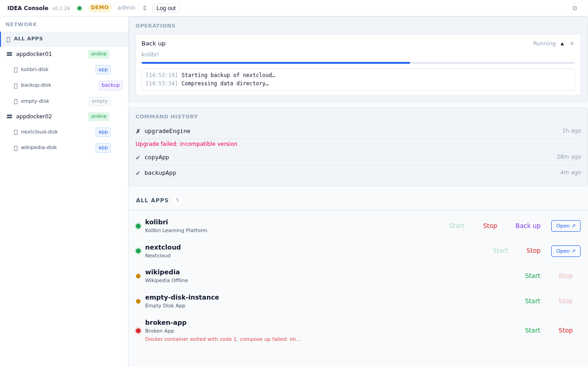

---

## Screen 6: Account Screen

**File:** `src/components/AccountScreen.tsx`  
**When shown:** 👤 button in status bar (always visible). Replaces content area entirely.

**When NOT logged in:**
- Inline login form (username + password + Log in button)

**When logged in:**
- Username + role
- Change password form
- "Manage Operators" button — drills into `OperatorManagement` inline
- "Log out" danger button at bottom

After logout: Account Screen stays open showing the login form. No auto modal.

> Note: there is no Close button inside the panel — the 👤 status bar button toggles it open/closed.

**Flows from here:**
- Log in → Account Screen transitions to logged-in view; main layout appears behind
- Manage Operators → sub-view within Account Screen (Back button to return)
- Log out → Account Screen shows login form; content area shows App Browser behind

---

## Screen 7: Empty Disk Panel

**File:** `src/components/EmptyDiskPanel.tsx`  
**When shown:** Operator selects an empty-type disk in the Network Tree (right panel of Main Layout).

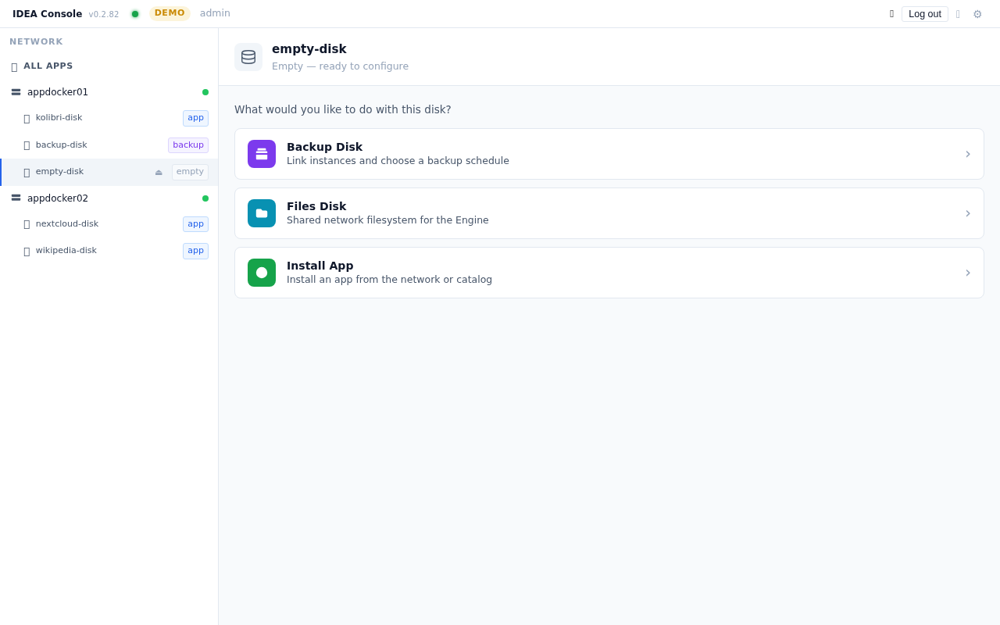

**Header:** disk icon + disk name + "Empty — ready to configure" subtitle. Back button appears when drilling into a sub-panel.

**Sub-states:**
- **Menu** — three action cards with coloured icons and chevrons:
  - 🟣 **Backup Disk** — link instances and choose a backup schedule
  - 🔵 **Files Disk** — shared network filesystem for the Engine
  - 🟢 **Install App** — install an app from the network or catalog
- **Backup Disk form** — radio group (On demand / Immediate / Scheduled) + instance checkbox list
- **Files Disk form** — confirmation text + submit
- **Install App form** — search input + app radio list + Install button
- **Success state** — confirmation message + Back button

---

## Screen 8: Restore Panel

**File:** `src/components/RestorePanel.tsx`  
**When shown:** Operator selects a backup-type disk in the Network Tree.

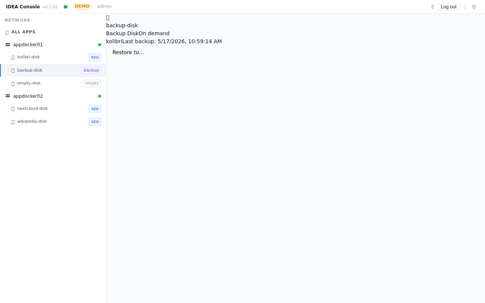

**Header:** disk icon + backup disk name + "Backup Disk" subtitle + backup mode (Immediate / On demand / Scheduled).

**Per-instance section:**
- Instance name + last backup timestamp
- Target disk selector (dropdown of available app/empty disks, excluding this backup disk)
- "Restore" button (disabled until target disk selected)
- On click: inline confirmation "Are you sure? This will overwrite [instance] on [target disk]" with Cancel / Confirm Restore
- On confirm: restore command sent; button re-disables

**Empty state:** "No instances backed up to this disk yet."

---

## Screen 9: History

**File:** `src/components/HistoryPanel.tsx`  
**When shown:** 📋 button in status bar (toggles; 📋 turns to ✕ while open). Replaces content area entirely.

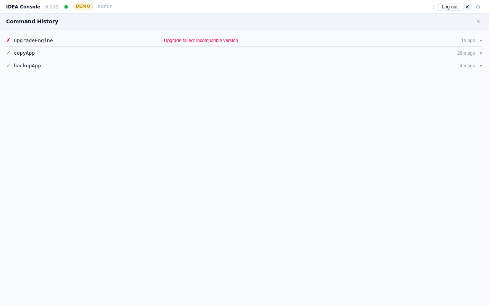

Lists recently completed commands (newest first). Each row shows:
- ✓ / ✗ status icon + command name + time-ago label
- Click to expand → `LogLines` viewer with the full captured log for that trace
- Error message shown inline for failed commands
- "No command history yet" placeholder when empty
- "Not available on this engine" message when the engine doesn't expose the command log endpoint

> Note: there is no Close button inside the panel — the 📋 status bar button toggles it open/closed.

**Files:** `src/components/HistoryPanel.tsx`, `src/components/CommandHistory.tsx`, `src/components/LogLines.tsx`, `src/store/commandLog.ts`, `src/types/commandLog.ts`

---

## Mobile Layout (≤600px)

**Files:** `src/components/MobileLayout.tsx`, `src/components/MobileAppList.tsx`  
**When shown:** Automatically on screens ≤600px wide (phones). Desktop layout is unchanged.

On mobile the main layout is replaced by a **bottom tab bar** with three tabs. The status bar remains at the top on all tabs.

### Tab 1 — Apps (default)

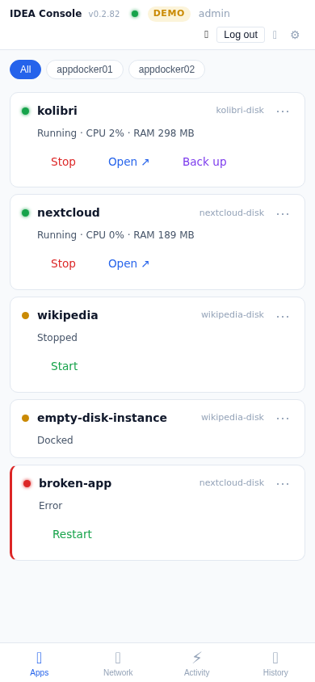

- Full-width app cards — name never truncated
- Engine filter chips at top to narrow by engine
- Status dot + name + disk name (right-aligned) + **⋯** menu button
- Status line (Running · CPU% · RAM) below name
- Contextual action buttons per status:
  - Running: **Stop**, **Open ↗**, **Back up** (disabled during active op)
  - Stopped: **Start**, **Back up**
  - Error: **Restart**
- Inline progress bar + label when a backup op is active for that instance
- Error cards have a red left border

**Action sheet** — tap **⋯** on any card to open:

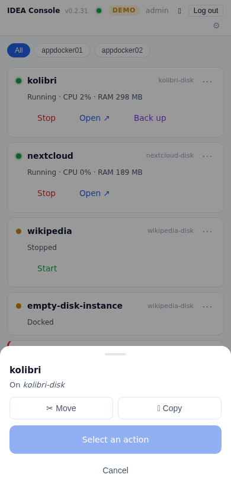

- Choose **Move** or **Copy**
- Disk list appears below (app disks, source disk excluded)
- Confirm button label updates to reflect op + target (e.g. *Copy to nextcloud-disk*)
- Back up is on the card itself, not duplicated here

**File:** `src/components/MobileCopyMoveSheet.tsx`

### Tab 2 — Network

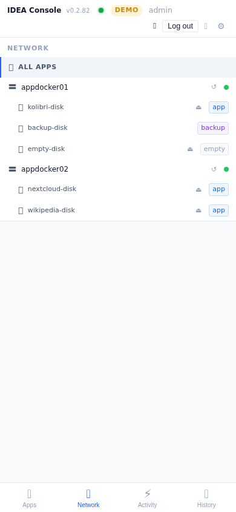

- Full-screen NetworkTree (no height cap)
- Same tree structure and behaviour as desktop
- **Eject (⏏) and Reboot (↺) buttons always visible** (not hover-only like on desktop)

### Tab 3 — Activity

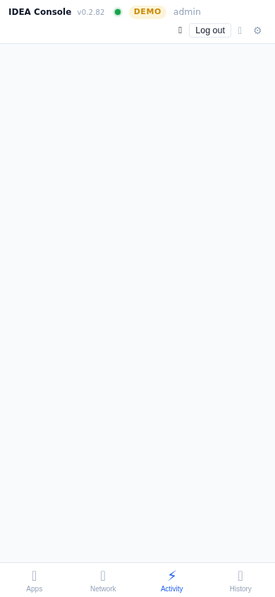

- OperationProgress + History panel (📋) accessible via status bar button
- Red badge on the tab icon shows count of active operations (Running/Pending)

---

## Screen Flow Diagram

```
                         ┌────────────────────────┐
                    ┌───▶│  Connection Management  │──────────────────────┐
                    │    │      (Screen 1)         │                      │
                    │    └────────────────────────-┘                      │
                    │           │ Connect                                  │
   App starts       │           ▼                                          │
   no config ───────┘    ┌─────────────────┐                              │
   or 🔌 pressed         │ First-Time Setup │                              │
                         │   (Screen 3)    │                              │
                         └────────┬────────┘                              │
                                  │ Create account                        │
                 ┌────────────────▼──────────────────────┐                │
  ⚙ (any screen)│        STATUS BAR (persistent)        │                │
  ──────────────▶│  🔌 Connection · 👤 Account · 📋 History · ⚙ Settings │◀──┘
                 └──────┬──────────────────┬─────────────┘
                        │                  │
              Not logged in             Logged in
                        │                  │
                        ▼                  ▼
              ┌─────────────┐   ┌──────────────────────────┐
              │ App Browser │   │     Main Layout           │
              │ (Screen 4)  │   │     (Screen 5)            │
              └──────┬──────┘   │                          │
                     │          │  NetworkTree + Workspace  │
                     │          │  ┌──────┬────────┬──────┐ │
              👤 Account        │  │Inst. │ Empty  │Backup│ │
              (Screen 6)        │  │ List │  Disk  │Disk  │ │
              shows login       │  │(5a)  │ (S7)   │ (S8) │ │
              form inline       │  └──────┴────────┴──────┘ │
                     │          └──────────────────────────-┘
                     │ success            │ 👤
                     └────────────────────┤
                                          ▼
                                ┌─────────────────────┐
                                │   Account Screen     │
                                │    (Screen 6)        │
                                │  · Change password   │
                                │  · Manage Operators  │
                                │  · Log out           │
                                └─────────────────────┘
```

---
